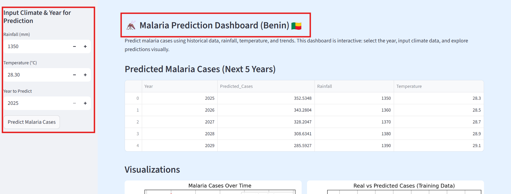
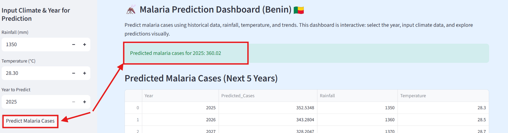
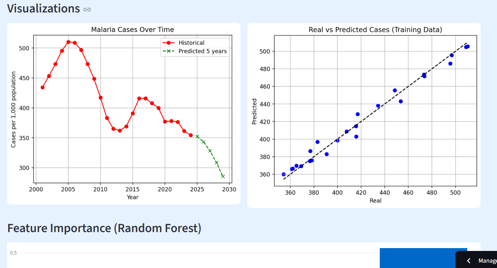

# 🦟 Malaria Prediction Dashboard (Benin)

<div align="center">

## 🔗 Project Links
- 📄 Research Proposal (DOI): [https://doi.org/10.5281/zenodo.19170416](https://doi.org/10.5281/zenodo.19170416)  
- 🌍 Live App: [https://malaria-prediction-benin-fadil-ade.streamlit.app/](https://malaria-prediction-benin-fadil-ade.streamlit.app/)  
- 💻 Source Code: [GitHub Repository](https://github.com/available-pixel/malaria_prediction_benin)  

</div>

## 📌 Project Overview

This project predicts malaria cases in Benin using machine learning and climate data such as rainfall and temperature.

It demonstrates how **Artificial Intelligence can be applied to public health** to better understand and anticipate disease trends.

---

## 📄 Published Research

This project is based on a published research proposal:

👉 https://doi.org/10.5281/zenodo.19170416

This publication demonstrates the application of machine learning in predicting malaria cases in Benin using climate data.

## 📄 Full Research Proposal (PDF)

The full research proposal for this project is available as a PDF:

[Download PDF](Malaria_Prediction_Benin_Research_Proposal.pdf)

## 📸 Application Preview

### 🔹 Dashboard



### 🔹 Prediction Result



### 🔹 Data Visualization



---

## 🚀 Features

* 📊 Predict malaria cases for any future year
* 📈 Forecast next 5 years automatically
* 🌧️ Input rainfall & temperature
* 📉 Interactive graphs and analysis
* 🧠 Feature importance explanation

---

## 🧠 Machine Learning Model

This project uses:

* **Random Forest Regressor** (main model)
* **Linear Regression** (baseline model)

### Features used:

* Rainfall
* Temperature
* Previous year malaria cases
* Year

---

## 📈 Model Performance

The models were evaluated using standard regression metrics:

- Mean Squared Error (MSE)
- Root Mean Squared Error (RMSE)

The Random Forest model outperformed Linear Regression, providing more accurate predictions of malaria cases.

These results confirm that machine learning can effectively capture patterns between climate factors and malaria incidence.

## 📊 How It Works

1. Load datasets (malaria + climate)
2. Filter data for Benin
3. Merge datasets by year
4. Train machine learning model
5. Predict malaria cases
6. Display results in a Streamlit dashboard

---

## ⚠️ Limitations
- Limited dataset size (yearly data only)
- Missing variables such as humidity, population density, and healthcare access
- Predictions depend on the accuracy of climate data

## 🚀 Future Improvements
- Include additional features (humidity, population data)
- Use more advanced models (e.g., XGBoost, Neural Networks)
- Expand the model to other African countries
- Integrate real-time data for live predictions

## 🛠️ Technologies Used

* Python
* Pandas
* Scikit-learn
* Matplotlib
* Streamlit

---

## 📂 Dataset Sources

* Our World in Data (Malaria data)
* Climate dataset (Rainfall & Temperature)

---

## 💻 Run Locally

```bash
git clone https://github.com/available-pixel/malaria_prediction_benin.git
cd malaria_prediction_benin

python -m venv venv
venv\Scripts\activate   # Windows

pip install -r requirements.txt
streamlit run app.py
```

---

## 🎯 Project Objective

* Apply AI to real-world health problems
* Build a strong portfolio project for scholarships
* Understand epidemic prediction using data

---

## ⚠️ Disclaimer

This project is for educational purposes only and does not provide medical advice.

---

## 👤 Author

**Fadil Owolara ADELABOU**
Aspiring Data Scientist | AI & Public Health Enthusiast
